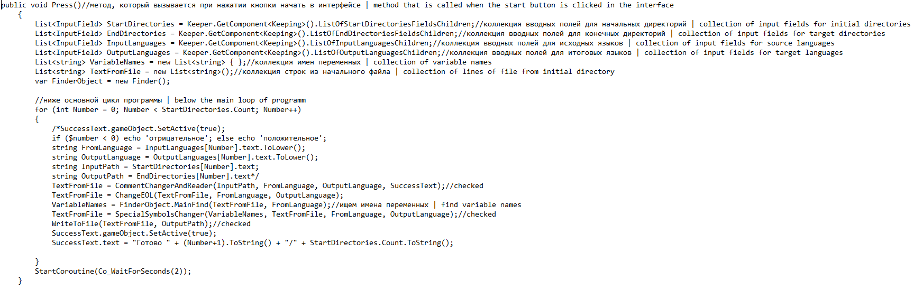
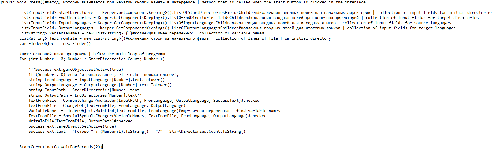

# System of automatization for routine operations when translating code from language to language
### **Description**
This project was developed during the Olympiad "Step into the Future", held by the Bauman Moscow State Technical University. The task of the product is to automate routine operations, such as:
* Replace special characters before variable names. The algorithm uses reflection, which allows the user to write their own algorithm for finding the names of variables that
they will use in the work. 
* Replace the end-of-line characters. The program takes into account the features of various programming languages (after which words in the line the line ending character is not used), but it works
  at the moment, the string by type is not ideal either:</br>
  PHP : ` 'if ($number < 0) echo 'negative';` ' < / br>
  will only be converted to< / br>
  Python : ` ' if (number < 0) echo 'negative';` ' < / br>
  The alogrithm takes into account the presence of quotation marks (it will not replace the end-of-line characters inside them) and comments (it will not replace the end-of-line characters after them). So, the line is as follows:< / br>
  C# : ` ' a =";"; / / text; " < / br>
  will be converted to< / br>
  Python : ` ' a = ";"#text;` ' </br>
* Replace the comment characters (single-line and multi-line). The program similarly takes into account quotation marks and does not touch the characters inside them.
* Replace the block split symbols. This operation was not fully implemented by me.
### **Example of work**
Initial file, C# language:

</br>
After running the program, with the target Python language:


# Система авоматизации рутинных операций при переводе кода с одного языка программирования (далее ЯП) на другой
### **Описание**
  Данный проект был разработан во время олимпиады "Шаг в Будущее", проводимой МГТУ им. Н.Э.Баумана. Задачей продукта является автоматизация рутинных операций таких как: 
  * Замена специальных символов перед именами переменных. Алгоритм использует рефлексию, что позволяет пользователю написать собственный алгоритм поиска имен переменных, который
  будет использован при работе. 
  * Замена символов завершения строки. Программа учитывает особенности различных ЯП (после каких слов в строке не используется символ завершения строки), однако работает
  на данный момент не идеально и строчка по типу:</br>
  PHP : ``` if ($number < 0) echo 'отрицательное';```</br>
  будет преобразована лишь в</br>
  Python : ```if (number < 0) echo 'отрицательное';```</br>
  Алогритм учитывает наличие кавычек (не заменит символы завершения строки внутри них) и комментариев (не заменить символы завершения строки после них). Таким образом строчка:</br>
  C# : ```a = ";";//text;```</br>
  будет преобразована в</br>
  Python : ```a = ";"#text;```</br>
  * Замена символов комментирования (одно и многострочных). Программа аналогично учитывает кавычки и не трогает символы, находящиеся внутри них.
  * Замена символов разделения блоков. Данная операция не была мною реализована до конца.
### **Пример работы программы**
Начальный файл, язык C#:

</br>
После работы программы, с целевым языком Python:

